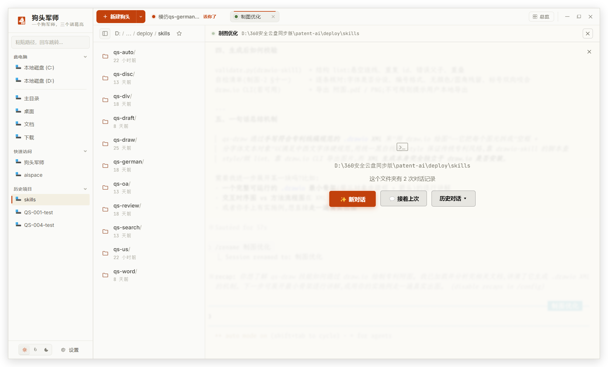
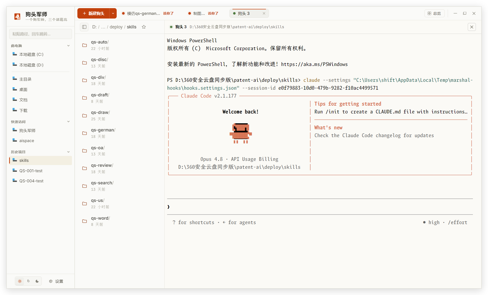
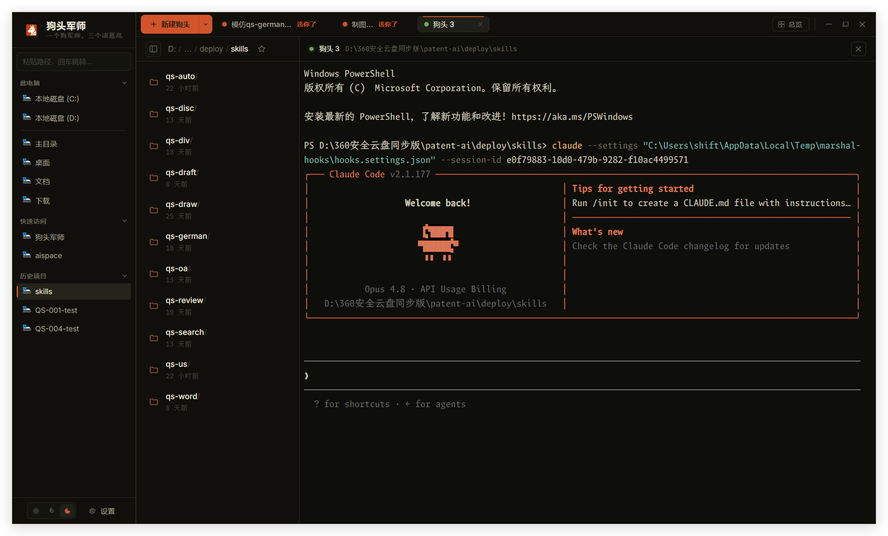
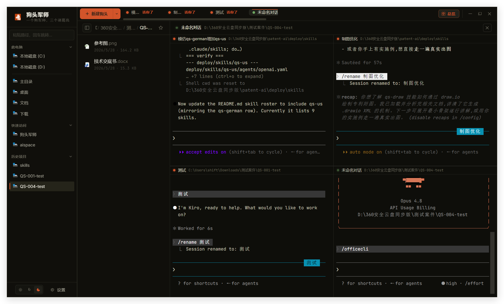

<div align="center">


# 狗头军师 · Kynsage

### 一个狗军师，三个诸葛亮

给**不写代码的人**用的 Claude Code 指挥台——
在一个窗口里同时指挥一群 AI 同事，谁在忙、谁等你拍板、谁改了文件，一眼看清。

<br>

### [⬇️ 下载 Windows 安装包](https://github.com/Qing-Gege/kynsage/releases/latest)

<sub>下载 · 双击 · 一路下一步——不用装 Node，不用敲命令</sub>

<br>

[](https://github.com/Qing-Gege/kynsage/releases/latest)

[](https://github.com/Qing-Gege/kynsage/releases/latest)
&nbsp;[](LICENSE)
&nbsp;[](#-下载安装)
&nbsp;[](#-下载安装)

**[下载](#-下载安装)** ｜ **[截图](#界面一览)** ｜ **[能做什么](#能做什么)** ｜ **[致谢](#致谢站在巨人的肩上)**

</div>

<br>



<p align="center"><sub>▲ 打开就是这样：进任意文件夹，「接着上次」一键续上上回的对话，全程点按钮，不碰命令行。</sub></p>

<br>


## 它解决什么问题

你想让 AI 同时帮你干好几摊事：一个写稿、一个查资料、一个改文档。用电脑自带的终端，就是**好几个黑窗口互相打架**——哪个在跑、哪个卡在等你确认、哪个刚改了文件，全靠脑子记，切来切去还容易切错。

**狗头军师把它们收进一个窗口**：左边是你熟悉的文件夹，右边是每个 AI 同事的工作台。点一下就新起一个同事、自动进入 Claude，全程不用你敲一条命令。切到谁，左边的文件区就自动跟到谁的目录；同事一改文件，旁边立刻刷新；轮到你拍板，它会主动闪烁喊你。

你坐在「统帅」位置，只管调度——**这是给不写代码的人造的工具，默认中文、术语说人话、点按钮就能用。**

<br>

## ⬇ 下载安装

<div align="center">

### [⬇️ 点这里下载最新版](https://github.com/Qing-Gege/kynsage/releases/latest)

</div>

**三步装好，跟装普通软件一模一样：**

1. 点上面的按钮，到下载页面，下载 **`Kynsage-x.x.x-win-x64.exe`** 这个文件（[也可以点这里直接下最新版](https://github.com/Qing-Gege/kynsage/releases/latest/download/Kynsage-0.0.11-win-x64.exe)）
2. 双击它，一路「下一步」（可以自己选装到哪、要不要桌面图标）
3. 装完桌面就有「狗头军师」图标，双击打开即可

> ⚠️ **首次打开 Windows 弹「已保护你的电脑 / 未知发布者」？** 这是新软件还没积累微软信誉的正常提示，不是病毒。点 **「更多信息」→「仍要运行」** 即可。

<br>

**🍎 用 Mac 的朋友**（Apple 芯片 / M 系列）：下载 **`Kynsage-0.0.11-mac-arm64.dmg`**（[点这里直接下](https://github.com/Qing-Gege/kynsage/releases/latest/download/Kynsage-0.0.11-mac-arm64.dmg)），拖进「应用程序」即可。

> ⚠️ 首次打开若提示 **「已损坏 / 无法验证开发者」**，是因为这个包还没做苹果签名——**右键点图标 →「打开」→ 再点「打开」** 就行；若仍打不开，打开「终端」粘贴执行 `xattr -cr /Applications/狗头军师.app` 后再双击。

**前提**：电脑里需要先装好 [Claude Code](https://claude.ai/code)（装过一次就行，狗头军师会自动找到它）。

<br>

## 界面一览


<p align="center"><sub>▲ <b>启动页 · 一眼上手</b>　打开就是这样：进任意文件夹，「接着上次」一键续上上回，全程点按钮。</sub></p>

<br>



<p align="center"><sub>▲ <b>亮色 · 强光环境</b>　三栏工作台：左边导航项目、中间文件夹、右边同事在跑 Claude Code。</sub></p>

<br>



<p align="center"><sub>▲ <b>暗色 · 专注工作</b>　八套主题随光照切换，Claude Code 的配色也跟着一起换。</sub></p>

<br>



<p align="center"><sub>▲ <b>总览 · 一屏看全</b>　所有同事的工作台平铺成一屏，每格带名字和状态灯，谁忙谁闲一眼看清；点一下就回到单个。</sub></p>

<br>


<p align="center"><sub>▲ <b>设置 · 全部说人话</b>　改完即时生效、自动保存，没有「保存」按钮要你记得按。</sub></p>

<br>

## 能做什么

### 🗂️ 多开同事，想开几个开几个

- **一键起同事，自动进 Claude**——点「新建同事」，就在当前文件夹起一个工作台并**自动拉起 Claude**，全程你不用敲一条命令。
- **没有数量上限**——一个、三个、十几个几十个并行都行，每个同事一个标签页，顶栏一字排开。
- **状态信号灯**——每个标签一盏灯：绿=正在干、琥珀=等你确认、灰=已结束。谁在忙、谁在等，扫一眼就知道。
- **一键总览**——把所有同事的工作台平铺成一屏，每格带名字和状态灯，全局尽收眼底；再点一下回到单个。
- **自动起名**——标签默认叫「同事 1 / 2 / 3」，Claude 一聊出主题就自动改成对话标题，不用你手动命名。
- **顺手开个纯终端**——「＋」旁边下拉「打开终端」，在当前目录起一个普通命令行（不启动 Claude），临时用一下不占用同事。
- **称呼随你改**——不喜欢叫「同事」？设置里改成你顺口的叫法，全应用的按钮和提示都跟着变。

### 🔀 文件区永远跟着当前会话走

- **切到谁，就看谁的目录**——点哪个同事的标签，左边文件区自动切到它的工作目录；同事在终端里 `cd` 去了别处，文件区也跟着走过去。你永远看的是「此刻这个同事正在动的文件」。
- **改动实时刷新**——同事新建、修改、删除文件，列表当场更新，不用你手动刷新。

### 🔔 该你拍板时，它会喊你

AI 干到一半需要你点「同意」时，就算你正盯着另一个同事，也不会漏——

- 那个同事的**终端区会闪烁**引起注意；
- **标题栏弹提示** + 右上角冒一条 **toast**；
- 还可以「**叮**」一声（设置里能试听、能关）。

多开也不怕错过任何一次「轮到你了」。

### 📁 像资源管理器一样管文件

- **系统原生图标**——`.docx / .pdf / .png` 显示真实类型图标，文件夹是品牌暖色，跟 Windows 里看到的一样。
- **右键全都有**——新建（文件夹 / Word / Markdown / 文本）、重命名、复制、剪切、粘贴、复制路径、在文件管理器中显示、删除到回收站。
- **跨软件复制粘贴**——不只是应用内，从「资源管理器 / 访达」里复制的文件，也能直接粘进来。
- **拖进来就导入** + 熟悉的 **Ctrl+C / X / V** 快捷键（在编辑器里不抢键）。
- **面包屑导航**——顶部显示完整路径，太长自动折叠中段，点任意一段就跳过去。

### ✍️ 双击 `.md`，像 Word 一样改

- **所见即所得**——双击 Markdown 文件，直接在应用里像文档一样编辑，不是左边写代码右边看预览。
- **富内容都支持**——表格、图片、代码块、**数学公式**、**流程图**，浮动工具栏随选随用。
- **自动保存**——停笔 1.5 秒自动落盘，标题栏显示「已保存 / 未保存」，关闭前强制保存，不丢内容。

### 🖥️ 真终端 · 记得每个项目 · 自动接上次

- **真正的终端**——Claude Code 的彩色输出、界面动画都正常显示，中文路径不乱码（Windows 用原生 ConPTY）。
- **每个文件夹记得自己的对话**——进一个用过的文件夹，会提示「这个文件夹有 N 次对话记录」，点「**接着上次**」自动续上最近一次，不用从头讲。
- **历史对话一键翻**——「历史对话」下拉列出这个文件夹里所有聊过的 Claude 会话（带标题和时间），点一条就恢复。

### 🎨 八套主题 + 字体臻选

- **八套主题**——纯白、中性灰、米白纸感、暖黄、薄荷绿、淡蓝（六款亮色/护眼）＋炭灰、墨蓝（两款深色），随手切换，品牌赤陶红贯穿始终；Claude Code 终端配色也跟着一起换。
- **字体臻选**——内置两款为中英混排优化的等宽字体（**霞鹜文楷 Bright Code GB**、**Maple Mono NL CN**，离线可用），另可选 JetBrains Mono / Fira Code 等，每款带真实预览，点一下立即换上。
- **字号、光标、提示音**……全部可调，下方还有一段模拟对话实时预览你的改动。

### 🐕 为不写代码的人而造

默认中文、术语说人话、Windows 优先。新建、恢复、设置全是点按钮，Claude Code 在后台自动拉起——**你不必记住任何一条命令。** 会用文件夹和 Word，就会用它。

<br>

## 谁在用

面向**用 Claude Code 处理文档、写作、分析工作的知识工作者**。凡是要同时推进好几摊事的人，都能坐上「统帅」位——

| 谁 | 三个「同事」可以同时 |
| :--- | :--- |
| **作家 / 编辑** | 第三章续写 ｜ 资料整理 ｜ 全书校对润色 |
| **自媒体 / 内容运营** | 公众号选题写稿 ｜ 小红书文案 ｜ 视频脚本 |
| **律师 / 法务** | 合同起草 ｜ 证据梳理 ｜ 法规检索 |
| **产品经理** | 写 PRD ｜ 竞品分析 ｜ 用户调研整理 |
| **市场 / 营销** | 活动方案 ｜ 投放文案 ｜ 数据周报 |
| **研究员 / 分析师** | 文献综述 ｜ 数据分析 ｜ 报告撰写 |
| **学生 / 学术** | 论文写作 ｜ 参考文献整理 ｜ 翻译润色 |
| **创业者 / 行政** | 商业计划书 ｜ 邮件 / 通知 ｜ 表格整理 |

<br>

## 设计理念

> **克制 · 大师 · 极简**——工匠工作台的美学：每个工具都有明确位置，每个表面都经过打磨，没有多余装饰，只有功能性的精确。

用户会长时间盯着这个界面工作，所以它追求**工具的消失感**：高密度但不拥挤、状态即时可见、操作零歧义。唯一的饱和色是品牌赤陶红 `#C2410C`，只占极小的可见表面——它的稀缺构成视觉层级。完整规范见 [DESIGN.md](./DESIGN.md)。

<br>

## 致谢（站在巨人的肩上）

狗头军师的产品思路，直接受 **[FanBox](https://github.com/alchaincyf/fanbox)**（[花叔](https://github.com/alchaincyf)）启发——「一边文件、一边终端、看清 agent 改了什么」的驾驶舱形态，是它先走通的。在此致谢。

它的能力也建立在这些出色的开源项目之上：

| 项目 | 用在哪 |
| :--- | :--- |
| [Claude Code](https://claude.ai/code) | 真正干活的 AI，狗头军师是它的指挥台 |
| [Electron](https://www.electronjs.org/) | 桌面外壳 |
| [xterm.js](https://xtermjs.org/) · [node-pty](https://github.com/microsoft/node-pty) | 内嵌的真实终端 |
| [Milkdown](https://milkdown.dev/)（Crepe） | Markdown 所见即所得编辑 |
| [霞鹜文楷](https://github.com/lxgw/LxgwWenkai) · [Maple Mono](https://github.com/subframe7536/maple-font) | 内置的中英混排字体（OFL） |

谢谢它们。

<br>

<details>
<summary><b>🔧 给开发者：从源码构建 & 技术栈</b></summary>

<br>

普通用户不需要看这一节——直接[下载安装包](#-下载安装)就好。这里是给想自己编译、参与开发的人。

```bash
# 克隆
git clone https://github.com/Qing-Gege/kynsage.git
cd kynsage

# 安装依赖并启动开发模式
pnpm install
pnpm dev

# 打包
pnpm build:win     # Windows 安装包（NSIS + 便携版）
pnpm build:mac     # macOS DMG
pnpm build:linux   # Linux AppImage
```

**环境要求**：Node.js 22+ ｜ pnpm ｜ 已安装 [Claude Code CLI](https://claude.ai/code)

**更多命令**：`pnpm typecheck`（类型检查）｜ `pnpm lint`（ESLint）｜ `pnpm test`（Vitest）｜ `pnpm format`（Prettier）

**技术栈**

| 领域 | 选型 |
| :--- | :--- |
| 桌面框架 | Electron 33 · TypeScript 5.7 |
| 构建 | Vite 6（渲染进程）· esbuild（主进程） |
| 终端 | @xterm/xterm 6 · node-pty 1（ConPTY / libpty） |
| 界面 | React 18 · Zustand 5 |
| 通信 | tRPC 11 · Zod（端到端类型安全） |
| 编辑器 | Milkdown Crepe 7（基于 ProseMirror） |
| 测试 | Vitest |

Monorepo（pnpm workspace）结构与数据流详见 [ARCHITECTURE.md](./ARCHITECTURE.md)；产品定位与设计原则见 [PRODUCT.md](./PRODUCT.md)。

</details>

<br>

## 许可

本项目以 [MIT](LICENSE) 许可开源，欢迎 Issue 与 Pull Request。

<div align="center">
<br>
<sub>MIT © 2026 Qing-Gege · 一个狗军师，三个诸葛亮</sub>
</div>
